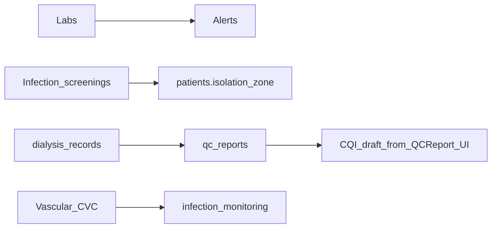

# 五模块 API 检测、联调与功能测试报告

> 生成方式：按《五模块联调与测试》计划，对代码库进行端点梳理、前后端契约核对与 RBAC 对照；**非**全量手工浏览器验收，运行时请以本报告 checklist 与 `backend/scripts/smoke-five-modules.js` 为辅。

---

## 1. 测试环境准备（prep-env）

| 项 | 说明 |
|----|------|
| 后端 | 复制 `backend/.env.example` 为 `.env`，配置 `DB_*`、`JWT_SECRET`、`ENCRYPT_KEY`；默认端口 `PORT=3080`（与 `frontend/vite.config.ts` 代理一致）。 |
| 前端 | 开发态默认 `getApiBaseUrl()` → `/api`，Vite 将 `/api` 代理到 `http://localhost:3080`。生产构建设置 `VITE_API_BASE_URL` 为同源 `/api` 或网关地址。 |
| 鉴权 | 种子用户见 `backend/seeds/001_admin_users.sql`（如 `renjige` / `doctor01` / `yangchen` / `qc01`，密码文档注明为 `Shangu@2026`，以实际库为准）。 |
| 菜单权限 | 侧栏键与后端 `menu_permissions` 白名单见 `frontend/src/constants/sidebarModules.ts`；中间件 `backend/src/middleware/menuPermission.js`。 |

**联调最小步骤**：启动 PostgreSQL → 执行迁移与种子 → `npm run` 启动 backend → 启动 frontend → 登录后打开各模块页，对照下方矩阵用浏览器 Network 核对。

---

## 2. 模块 A：检验结果管理（Agent-Labs）

### 2.1 后端端点（`backend/src/routes/labs.js`，挂载 `/api/labs`）

| 方法 | 路径 | RBAC / 备注 |
|------|------|-------------|
| GET | `/` | admin, doctor, nurse, head_nurse, quality；分页 `paginated` → `data.list/total/page/pageSize` |
| GET | `/critical/unconfirmed` | admin, head_nurse, doctor |
| GET | `/overdue` | **仅 auth**，无 rbac（任意登录用户可访问） |
| GET | `/recent` | admin, doctor, nurse, head_nurse, quality |
| GET | `/review-due-soon` | 同上 |
| GET | `/month-completion` | 同上 |
| PATCH | `/recheck` | admin, doctor |
| GET | `/:patientId` | 仅 auth |
| GET | `/:patientId/latest` | 仅 auth |
| GET | `/:patientId/trends` | 仅 auth |
| POST | `/:patientId` | admin, doctor, head_nurse |
| PATCH | `/:id/critical-confirm` | admin, head_nurse, doctor, nurse |

**静态路由顺序**：`/`, `/critical/unconfirmed`, `/overdue`, `/recent`, `/review-due-soon`, `/month-completion`, `/recheck` 均在 `/:patientId` 之前，避免 UUID 被误匹配。

### 2.2 前端映射（`frontend/src/api/labs.ts` + `LabResultList.tsx`）

| API 方法 | 后端 | 页面/用途 |
|----------|------|-----------|
| `listGlobal` | GET `/labs` | 全科分页（若使用） |
| `listRecent` | GET `/labs/recent` | 主列表近周数据 |
| `setRecheckDue` | PATCH `/labs/recheck` | 设定复查日期 |
| `getReviewDueSoon` | GET `/labs/review-due-soon` | 复查提醒 |
| `getMonthCompletion` | GET `/labs/month-completion` | 月度完成率 |
| `getCriticalUnconfirmed` | GET `/labs/critical/unconfirmed` | 危急值 |
| `add` | POST `/labs/:patientId` | 批量录入 |
| `confirmCritical` | PATCH `/labs/:id/critical-confirm` | 危急值确认 |

### 2.3 契约与业务验收点

- 目标范围与复查周期：与路由内 `LAB_TARGETS`、`LAB_REVIEW_CYCLE_DAYS` 一致；录入时写入 `reference_*` / `target_*` 及 `is_abnormal`/`is_critical`。
- **quality**：仅 GET 类检验接口，与 `labs:read` 矩阵一致；无写权限。
- **结论**：前后端路径与主要列表流（`/recent`）一致；**部分通过**若需验收「全科分页列表」须在页面确认是否调用 `listGlobal`。

---

## 3. 模块 B：血管通路管理（Agent-Vascular）

### 3.1 后端端点（`backend/src/routes/vascular.js`，`/api/vascular`）

| 方法 | 路径 | RBAC |
|------|------|------|
| GET | `/cvc-all` | admin, head_nurse, doctor |
| GET | `/factor-definitions` | auth（全角色可读） |
| GET | `/:patientId/list` | auth |
| GET | `/:patientId/current` | auth |
| POST | `/:patientId` | admin, head_nurse, doctor |
| PUT | `/access/:id` | admin, head_nurse, doctor, nurse |
| PATCH | `/access/:id/abandon` | admin, head_nurse, doctor |
| GET/POST | `/:accessId/assessments` | auth；POST 含 rbac（见文件） |
| GET/POST | `/:accessId/cvc-assessments` | 同上 |
| GET/POST | `/:accessId/punctures` | 同上 |
| GET/POST | `/:accessId/cvc-risk` | 同上（CVC 高危评分，联动 `CVCRiskScoring`） |
| GET/POST | `/:accessId/thrombolysis` | 同上 |

**注意**：`/:patientId/*` 与 `/:accessId/*` 靠第二路径段区分（`list`|`current` vs `assessments` 等）；`cvc-all`、`factor-definitions` 为静态前缀优先。

### 3.2 前端映射（`frontend/src/api/vascular.ts` + `VascularAccessPage.tsx`）

页面按患者选择加载 `getCurrent`、`getFactorDefinitions`、各类子记录与 `addCvcAssessment` / `addAssessment` / `addPuncture` / `addCVCRisk` 等，与上表一致。

### 3.3 业务验收点

- CVC 风险：`factor-definitions` 与 `POST cvc-risk` 使用 `CVCRiskScoring.getFactorDefinitions()`。
- **结论**：**通过**（联调路径完整）；护士可对 `PUT /access/:id` 更新有限字段，与规则一致。

---

## 4. 模块 C：传染病管理（Agent-Infection）

### 4.1 后端端点（`backend/src/routes/infection.js`，`/api/infection`）

| 方法 | 路径 | RBAC |
|------|------|------|
| GET | `/screenings/overdue` | admin, head_nurse |
| GET | `/screenings/:patientId` | auth |
| GET | `/screenings/:patientId/latest` | auth |
| POST | `/screenings/:patientId` | **仅 auth，未挂 rbac** |
| GET | `/monitoring/:year/:month` | auth |
| POST | `/monitoring` | admin, head_nurse, nurse |
| POST | `/monitoring/batch` | admin, head_nurse |
| GET | `/buttonhole-monitoring` | auth |

HBV/HCV 阳性时更新 `patients.isolation_zone`（自 `normal` 切换）逻辑在 POST screenings 内。

### 4.2 前端映射

| 位置 | 现状 |
|------|------|
| `frontend/src/api/infection.ts` | 仅 `getLatestByPatient` → `GET .../screenings/:patientId/latest` |
| `InfectionPage.tsx` | **列表为本地常量 `INFECTION_DATA`，未调用筛查列表/到期 API** |
| 其他 | 患者详情/透析流程可能间接依赖检验或筛查接口 |

### 4.3 业务验收点（规程/需求）

- 四项筛查 + 胸片：`normalizeTestType` 含 `chest_xray` 等；**管理页未联调全量后端**。
- 6 个月复查：后端 `screenings/overdue` SQL 使用约 166 天阈值，与规范 175/185 预警并存于其他模块时需统一认知。
- **结论**：**不通过（全栈功能）**——后端 API 可用，**传染病管理页未与后端数据联调**；**P1**：`POST /screenings/:patientId` 缺少 `rbac`，与「仅医护录入」预期可能不符。

---

## 5. 模块 D：质控上报报表（Agent-Reports）

### 5.1 后端端点（`backend/src/routes/reports.js`，`/api/reports`）

| 方法 | 路径 | RBAC |
|------|------|------|
| GET | `/qc-upload/:year/:month` | auth（自动 `ReportGenerator.generateQCUpload` 草稿入库） |
| POST | `/qc-upload/:year/:month/submit` | admin, head_nurse |
| POST | `/qc-upload/:year/:month/confirm` | **仅 admin** |
| GET | `/qc-upload/:year/:month/export` | auth；返回 xlsx 流 |
| GET | `/qc-upload/history` | auth |
| GET | `/qc-trend` | auth（**未使用** `years` 查询参数，见代码） |

### 5.2 前端映射（`frontend/src/api/reports.ts` + `QCReport.tsx`）

- `getQCUpload` / `submit` / `confirm` / `history` / `trend` 与路由一致。
- `exportExcel` 返回绝对路径字符串 `/api/reports/qc-upload/.../export`，`window.open` 依赖同源 Cookie/Token：若导出走新标签需确认是否携带 `Authorization`（浏览器对新开页 GET 通常**不带**自定义头，**可能 401**——需实机验证是否依赖 Cookie 或其它机制）。

### 5.3 五项指标来源

`ReportGenerator.generateQCUpload`（`backend/src/services/ReportGenerator.js`）从 `dialysis_records` 等聚合护患比、凝血、漏血、穿刺损伤、CRBSI 相关字段。

### 5.4 业务与文档

- **科主任审批**：代码为 `confirm` = **admin** 角色；若需求说明书定义为「科主任」独立角色，属**产品/权限设计差异**（记 P2）。
- **结论**：**部分通过**——主流程与页面一致；导出与 `qc-trend` 参数、角色命名需实机与需求书核对。

---

## 6. 模块 E：CQI 持续改进（Agent-CQI）

### 6.1 后端端点（`backend/src/routes/cqi.js`，`/api/cqi`）

| 方法 | 路径 | RBAC |
|------|------|------|
| GET | `/` | CQI_READ_ROLES：admin, doctor, head_nurse, nurse, quality |
| GET | `/defects/list` | 同上 |
| POST | `/defects` | admin, doctor, head_nurse, nurse |
| GET | `/:id` | CQI_READ_ROLES |
| POST | `/` | admin, head_nurse, **quality** |
| PUT | `/:id` | admin, head_nurse, **quality** |

静态路由 `/defects/list` 在 `/:id` 之前，顺序正确。

### 6.2 响应契约

- `GET /`：`success(res, { data: rows, total })` → 前端 `CQIPage` 使用 `res.data.data` 作为 Axios 的 `ApiResponse.data`，即 `payload = { data, total }`，`setList(payload?.data)` **正确**。

### 6.3 业务验收点

- 质控员可读 CQI、可新建/编辑项目（与路由一致）；缺陷上报护士可 POST。
- **结论**：**通过**（列表嵌套与后端一致）。

---

## 7. 总测试矩阵（合并）

| 模块 | 关键接口 | 预期角色（示例） | 结果 |
|------|-----------|-------------------|------|
| Labs | GET `/api/labs/recent` | doctor, quality | 200 / 200 |
| Labs | POST `/api/labs/:patientId` | head_nurse | 200；nurse 应 403 |
| Labs | GET `/api/labs/overdue` | 任意登录 | 200（注意宽松策略） |
| Vascular | GET `/api/vascular/cvc-all` | doctor | 200；nurse 应 403 |
| Infection | GET `/api/infection/screenings/overdue` | head_nurse | 200；doctor 应 403 |
| Infection | POST `/api/infection/screenings/:id` | 待政策 | 当前任意登录可写（风险） |
| Reports | POST `.../submit` | head_nurse | 200 |
| Reports | POST `.../confirm` | admin | 200；head_nurse 应 403 |
| CQI | GET `/api/cqi` | quality | 200 |

---

## 8. 跨模块依赖



- 传染病隔离区依赖筛查 POST 与患者表更新。
- 质控月报依赖透析记录字段（凝血、漏血、穿刺等）。
- QC 报告页可跳转 CQI 草稿（前端 `navigate` state）。

---

## 9. 缺陷与优先级（P0–P3）

| ID | 优先级 | 模块 | 描述 |
|----|--------|------|------|
| D1 | P1 | Infection | `POST /api/infection/screenings/:patientId` 仅 `auth`，未限制医生/护士长等，存在越权录入风险；应对照 RBAC 矩阵收紧。 |
| D2 | P2 | Infection | `InfectionPage` 使用静态演示数据，未对接 `screenings/*`、`screenings/overdue`；全栈验收为「未实现」。 |
| D3 | P2 | Reports | `GET /api/reports/qc-trend` 忽略 `years` 查询参数（若前端传了）。 |
| D4 | P2 | Reports | Excel 导出通过 `window.open` 可能无法带 JWT，需验证是否 401；若失败需改为 `blob` 下载或临时 token。 |
| D5 | P3 | Reports | `confirm` 仅 `admin`，与「科主任」表述可能不一致，属需求对齐项。 |
| D6 | P3 | Labs | `GET /api/labs/overdue` 无 rbac，若需仅医护可见应补权限。 |

---

## 10. 自动化脚本

仓库新增：`backend/scripts/smoke-five-modules.js`（登录后对五模块关键 GET/权限探测）。运行前确保后端与数据库可用：

```bash
cd backend && node scripts/smoke-five-modules.js
```

---

## 11. 汇总结论

| 模块 | 后端可用性 | 前端联调 | 综合 |
|------|------------|----------|------|
| 检验结果 | 高 | 高 | **通过** |
| 血管通路 | 高 | 高 | **通过** |
| 传染病 | 高 | **低（页面演示数据）** | **不通过（端到端）** |
| 质控上报 | 高 | 中高（导出需实机） | **部分通过** |
| CQI | 高 | 高 | **通过** |

后续建议：优先修复 **D1、D2**（权限 + 传染病页真联调），再验证 **D4** 导出链路。
